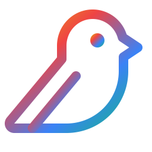

<p align="center">
  
</p>

<h1 align="center">SecureOpenClaw</h1>

<p align="center">
  <a href="https://github.com/macawsecurity/secureOpenClaw/blob/main/LICENSE"></a>
  <a href="https://github.com/macawsecurity/secureOpenClaw/blob/main/LICENSE-MACAW"></a>
  <a href="https://console.macawsecurity.ai"></a>
</p>

<p align="center">
  Secure version of OpenClaw using the MACAW trust layer.
</p>

Every compute paradigm scaled on a foundation of trust — mainframes had Kerberos,
microservices got mTLS, agents need MACAW. Deterministic controls, zero-trust
design, identity orchestration, and cryptographic attestation for protecting
context, prompts, tools, and LLM invocations.

Forked from OpenClaw with ~850 lines of TypeScript and a Python sidecar.
Minimal changes to core — the trust layer wraps, doesn't rewrite.

## Security Model

Two dimensions:

**1. Complete Interception**

Every invocation — tools, LLMs, skills, plugins — routes through MACAW before
execution. No exceptions, no bypasses.

```
alice@telegram → secure-openclaw → tool:exec
                      │
                      ├──→ secure-openai → gpt-4o
                      │
                      └──→ tool:write
```

**2. Layered Policy Controls**

Out-of-box policies provide graduated control across three axes:

| Axis | Levels |
|------|--------|
| **Roles** | `owner` · `admin` · `user` · `guest` |
| **Invocations** | `never` · `one-time approval` · `per-invocation approval` · `time-bounded approval` |
| **Prompts** | Lineage tracked, derivations monotonically restricted (child scope ≤ parent scope) |

Skills and prompts eventually map to tool invocations. Each tool has a policy.
Each skill has a policy. Policies compose via inheritance.

## How It Fits Together

```
┌─────────────────────────────────────────────────────────────────────────┐
│  USER IDENTITY                                                          │
│  alice@telegram (role: user)                                            │
└────────────────────────────┬────────────────────────────────────────────┘
                             │
                             ▼
┌─────────────────────────────────────────────────────────────────────────┐
│  PROMPT                                                                 │
│  Authenticated, signed, lineage-tracked                                 │
│  Derivations inherit parent constraints (can only narrow, never widen)  │
└────────────────────────────┬────────────────────────────────────────────┘
                             │
                             ▼
┌─────────────────────────────────────────────────────────────────────────┐
│  SKILL                                                                  │
│  Policy: skill:cleanup extends secureopenclaw                           │
│  Controls: which tools, which paths, attestation requirements           │
└────────────────────────────┬────────────────────────────────────────────┘
                             │
                             ▼
┌─────────────────────────────────────────────────────────────────────────┐
│  TOOL                                                                   │
│  Policy: tool:exec extends secureopenclaw                               │
│  Controls: denied commands, denied paths, approval requirements         │
└────────────────────────────┬────────────────────────────────────────────┘
                             │
                             ▼
┌─────────────────────────────────────────────────────────────────────────┐
│  EFFECTIVE POLICY                                                       │
│  = role:user ∩ skill:cleanup ∩ tool:exec                                │
│  Most restrictive wins at every layer                                   │
└─────────────────────────────────────────────────────────────────────────┘
```

## Cryptographic Identity

Every participant has a keypair and signs its invocations:

| Entity | Identity | Signs |
|--------|----------|-------|
| User | `alice@telegram` | Requests from chat |
| Service | `secure-openclaw` | Tool invocations |
| LLM Adapter | `secure-openai` | API calls to OpenAI |
| Tool | `tool:exec` | Execution results |

Signatures are verified at each hop. Audit trail is cryptographically tamper-evident.

## Approval Mechanisms

Attestations provide cryptographic proof of approval:

| Type | Use Case |
|------|----------|
| **Never allowed** | `rm -rf /`, credential files — blocked unconditionally |
| **One-time approval** | Unknown skill — admin approves once, then trusted |
| **Per-invocation** | Sensitive action — requires approval each time |
| **Time-bounded** | Action mode — approval valid for 4 hours |

Approvals can be programmatic (LLM judge, automated checks) or human-in-the-loop
(console notification, chat confirmation).

## Prompt Protection

Built-in, no special handling required.

Prompts are authenticated and tracked through derivation chains. When an LLM
generates a sub-prompt or tool call, the derived request inherits the parent's
constraints and can only narrow them further.

A prompt injection that tries to escalate permissions fails — the derived prompt
cannot exceed the scope of its parent, cryptographically enforced.

## Architecture

```
┌────────────────────────────────────────────────────────────────────────────┐
│  CHANNELS                                                                  │
│  WhatsApp │ Telegram │ Slack │ Discord │ Signal │ Teams │ iMessage        │
│                          │                                                 │
│                          ▼                                                 │
│  ┌──────────────────────────────────────────────────────────────────────┐ │
│  │  OPENCLAW CORE                                                       │ │
│  │  Gateway │ Sessions │ Skills │ LLM Orchestration                     │ │
│  └──────────────────────────────┬───────────────────────────────────────┘ │
│                                 │                                          │
│                                 ▼ All invocations                          │
│  ┌──────────────────────────────────────────────────────────────────────┐ │
│  │  MACAW INTERCEPTION                                                  │ │
│  │  tool-wrapper.ts → bridge.ts → sidecar (Python)                      │ │
│  └──────────────────────────────┬───────────────────────────────────────┘ │
└─────────────────────────────────┼──────────────────────────────────────────┘
                                  │
                                  ▼
┌────────────────────────────────────────────────────────────────────────────┐
│  MACAW SIDECAR                                                             │
│  MACAWClient │ SecureOpenAI │ SecureAnthropic │ Policy Engine             │
└────────────────────────────────────────────────────────────────────────────┘
                                  │
                                  ▼
┌────────────────────────────────────────────────────────────────────────────┐
│  MACAW CONSOLE                                                             │
│  Policies │ Activity Graph │ Agents │ Audit Logs │ Approvals              │
└────────────────────────────────────────────────────────────────────────────┘
```

## Installation

```bash
git clone https://github.com/macawsecurity/secureOpenClaw.git
cd secureOpenClaw
./install.sh
npm start
```

Policies are in `policies/` — load them into the console for management.

## MACAW Trust Layer

SecureOpenClaw is powered by [MACAW](https://www.macawsecurity.ai) — cryptographic
identity, policy enforcement, and audit logging for AI agents.

**Free for developers** — 150K events/month.

Sign up: [console.macawsecurity.ai](https://console.macawsecurity.ai)

## Research

- [Authenticated Workflows: A Systems Approach to Protecting Agentic AI](https://arxiv.org/abs/2602.10465)
- [Protecting Context and Prompts: Deterministic Security for Non-Deterministic AI](https://arxiv.org/abs/2602.10481)

Further reading: [www.macawsecurity.ai/research](https://www.macawsecurity.ai/research)

## OpenClaw Documentation

For channels, skills, and usage: [docs.openclaw.ai](https://docs.openclaw.ai)

## License

- OpenClaw original code: MIT License (see [LICENSE](LICENSE))
- MACAW integration (`src/macaw/`, `sidecar/`, `policies/`): Apache 2.0 (see [LICENSE-MACAW](LICENSE-MACAW))

---

*Built on [MACAW](https://www.macawsecurity.ai) and [OpenClaw](https://github.com/openclaw/openclaw)*
